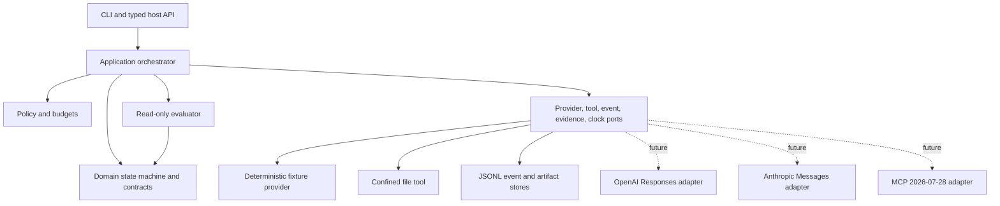

<!-- Purpose: Select the runtime foundation for the HVE-Forge coding harness. -->

# ADR-001: Own the Deterministic Harness Kernel

**Status:** Superseded by ADR-003 for runtime language; safety invariants retained  
**Date:** 2026-08-31  
**Author:** GitHub Copilot  
**Council:** `docs/artifacts/adr/COUNCIL-001-harness-runtime.md`

> Historical note: the .NET 10 choice was valid for the first local oracle. ADR-003
> replaces the active runtime with TypeScript/Node while preserving the invariants below.

## Context

HVE-Forge needs a production-oriented coding harness that remains observable, resumable, secure, model-agnostic, and controllable across long tasks. The repository contains useful AgentX workflow assets but no runnable application. The local machine has .NET 10, PowerShell 7.6, Python 3.12, and Node.js 24. No production target, live-model credentials, model choice, compliance regime, or spend authorization was provided, so the first implementation must be local-only, credential-free, and fail closed.

The hard requirements sit at trust boundaries: policy decisions, workspace confinement, durable events, replay, evidence freshness, independent review, and provider normalization. A framework can help with orchestration but cannot be allowed to weaken these invariants.

## Decision

Build a focused .NET 10 modular monolith whose core is a deterministic policy-and-replay kernel. The core owns versioned domain contracts, a pure state reducer, append-only hash-chained events, budgets, policy decisions, evidence binding, and completion rules. Infrastructure adapters own persistence, fixture providers, workspace tools, instruction discovery, and future live provider/MCP integrations. The CLI is the initial composition root.

The first thin slice uses a scripted fixture provider and no live model. It is described by `docs/execution/contracts/CONTRACT-001-policy-replay-kernel.md`.

A provider-neutral claim is prohibited until two live provider adapters pass the same contract suite. MCP support is designed behind a port and documented now, but full protocol execution is deferred until the local kernel is proven.

## Options considered

### Option A: Embed OpenAI Codex App Server or SDK

Codex provides a mature coding loop, sandbox integration, durable threads, streaming items, approvals, and multiple client surfaces.

**Advantages**

- Fastest route to a capable coding agent.
- Strong JSONL/stdio event and approval model.
- Active Apache-2.0 implementation and production usage.

**Disadvantages**

- The provider-specific runtime becomes the system of record.
- Model neutrality, evidence rules, and replay must adapt around upstream semantics.
- The security review surface is large and upgrades can alter policy behavior.

**Effort:** Medium  
**Risk:** High lock-in

### Option B: Use an agent SDK or workflow runtime

Candidates include Microsoft Agent Framework, LangGraph, OpenAI Agents SDK, and Claude Agent SDK.

**Advantages**

- Existing orchestration, streaming, tools, checkpointing, and tracing.
- Faster implementation than owning all workflow mechanics.
- Broad ecosystem support.

**Disadvantages**

- Framework state and prompts can become implicit authority.
- Microsoft Agent Framework is preview in the currently available guidance; LangGraph is Python-first.
- Sandboxing and completion evidence still remain application responsibilities.
- Deterministic replay can be incomplete when framework-internal retries and calls are hidden.

**Effort:** Medium  
**Risk:** Medium framework churn

### Option C: Focused runtime over provider APIs and protocol adapters

Own a small deterministic kernel and integrate providers/runtimes through leaf adapters.

**Advantages**

- Policy, durability, replay, evidence, and redaction are explicit and testable.
- Provider behavior is normalized without putting an SDK in the domain.
- A stable internal event and telemetry vocabulary isolates external churn.
- The implementation can stay local and credential-free until authority is supplied.

**Disadvantages**

- Highest up-front engineering effort.
- Easy to overbuild a generic agent framework.
- Windows workspace isolation is not equivalent to a container or microVM sandbox.

**Effort:** Large  
**Risk:** Medium scope risk

## Scored decision

The weighted comparison in `docs/research/ai-coding-harness-landscape.md` scores options A, B, and C at 91, 110, and 137 out of 155 respectively. Portability, sandbox control, durability, security review surface, and low lock-in carry the largest weights. Correcting the arithmetic did not change the ranking or decision.

Option C is selected because it is the only option where the required invariants are owned at the correct boundary. The decision is conditional on aggressive scope control: the MVP is a local policy-and-replay kernel, not a new universal workflow framework.

## Architecture

Dependency direction is inward:

- Domain references only the base class library.
- Application references Domain.
- Infrastructure references Application and Domain.
- CLI is the composition root and may reference all production projects.
- Provider SDKs, storage drivers, UI frameworks, and operating-system implementations never enter Domain.

## Consequences

### Positive

- Resume and replay can be tested without live providers or side effects.
- Policy denial and completion are deterministic state transitions.
- Provider, protocol, and telemetry churn is isolated in adapters.
- Local development cannot spend money or write remotely by accident.

### Negative

- The initial release provides less live-model functionality than an embedded Codex runtime.
- Strong process and network isolation still require a later container or microVM backend.
- Each live adapter needs substantial conformance and failure testing.

### Neutral

- Existing AgentX files remain workflow guidance rather than the new runtime store.
- JSONL is suitable for the first local append-only store; a transactional database can replace it behind the event port if measured concurrency demands it.

## Non-negotiable invariants

1. State transitions are pure and covered by deterministic tests.
2. Visible transition events are durably appended before acknowledgement.
3. Every event uses contiguous sequence numbers and a SHA-256 previous-hash chain.
4. Replay performs no provider or tool execution and rejects malformed, unknown-version, gapped, duplicated, or tampered events.
5. Policy is deny-by-default, deny-overrides-allow, data-driven, and evaluated before dispatch.
6. Tool paths are relative, canonically contained, and checked for Windows reparse points immediately before mutation.
7. Tool operations are idempotent and bounded.
8. Completion requires fresh evidence bound to the final workspace and event-chain hashes plus an independent read-only verdict.
9. Secret values never enter public events, evidence summaries, console output, or fixtures.
10. Unsupported external capabilities are explicit and never silently emulated or ignored.

## Deferred decisions

- Live primary and fallback models, pending an explicit budget and data/compliance decision.
- Container versus microVM isolation, pending deployment target and threat model.
- Durable database, pending multi-worker scale evidence.
- Full MCP client/server implementation, pending kernel acceptance and SDK revalidation.
- Web/IDE UI, pending CLI evidence and accessibility design.
- A2A, pending a real remote peer-agent requirement.

## Review history

| Date | Perspective | Outcome |
|---|---|---|
| 2026-08-31 | Architect | Option C preferred; own trust and replay boundaries. |
| 2026-08-31 | Data Scientist | Option C preferred for measurability; benchmark and adapter caveats recorded. |
| 2026-08-31 | Skeptical Reviewer | Changes requested until scope was cut to a fixture-backed policy/replay kernel. This ADR incorporates that correction. |
