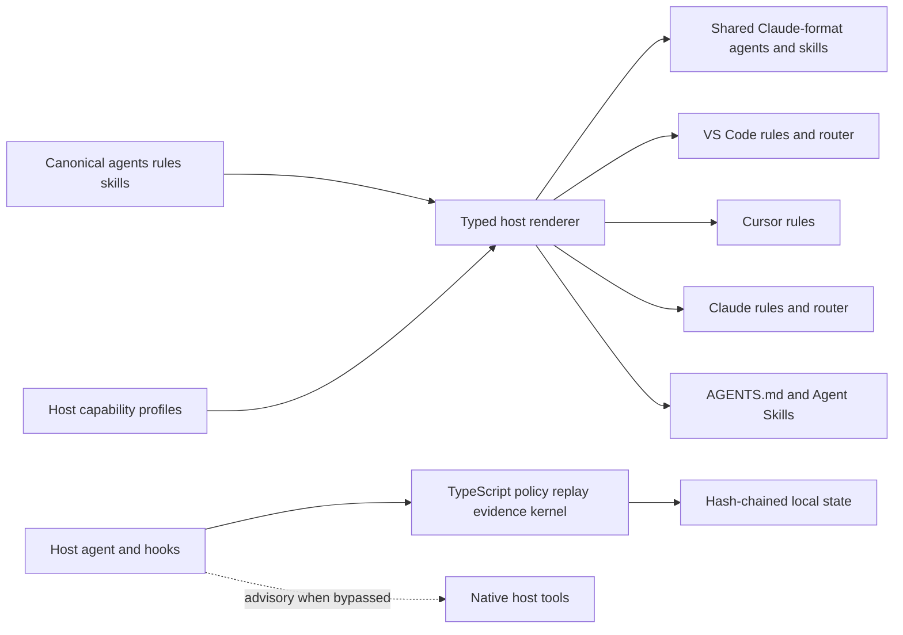

<!-- Purpose: Select the cross-editor authoring, rendering, and runtime migration architecture. -->

# ADR-003: Cross-Editor TypeScript Harness

**Status:** Accepted for phased implementation
**Date:** 2026-09-01
**Author:** GitHub Copilot
**Council:** `docs/artifacts/adr/COUNCIL-003-cross-editor-typescript-harness.md`
**Supersedes:** The .NET technology choice in `ADR-001`; its safety invariants remain normative.

## Context

HVE-Forge must work as a coherent engineering harness in VS Code/Copilot, Cursor, Claude Code, and future Agent Skills-compatible clients. The original deterministic oracle was implemented in .NET 10 and its agent assets were authored under VS Code-oriented paths. The user explicitly requires a non-.NET development path.

Current host conventions differ:

- VS Code uses `.github/agents`, `.github/instructions`, `.github/skills`, and `.vscode/mcp.json`.
- Cursor uses `.cursor/agents`, `.cursor/rules`, `.cursor/hooks.json`, and `.agents/skills` while also reading compatibility paths.
- Claude Code uses `.claude/agents`, `.claude/rules`, `.claude/settings.json`, `.claude/skills`, and root `CLAUDE.md`.
- `AGENTS.md` and Agent Skills are the portable floor, but neither alone enforces policy or durable evidence.

Research into gstack supports typed host configurations, generated artifacts, drift checks, and target-specific installation. AgentX supports canonical role/skill assets, thin host adapters, CLI-enforced quality gates, and durable artifacts. HVE-Forge additionally requires hash-chained events, replay, policy, budgets, redaction, and evidence-bound completion.

## Decision

Adopt a host-neutral canonical authoring layer and a TypeScript/Node runtime:

1. Canonical skills live under `hve/skills`, outside host scan paths, using the Agent Skills specification.
2. Canonical role and rule definitions live under `hve/agents` and `hve/rules`.
3. Typed host profiles and renderers emit host-compatible artifacts: one shared Claude-format agent and skill copy plus native scoped rules and routers for VS Code, Cursor, and Claude Code.
4. Generated files carry canonical source and SHA-256 provenance and are checked for drift.
5. A dependency-minimal TypeScript kernel owns policy, event integrity, replay, evidence, and host diagnostics.
6. Host hooks are adapters, never the sole security boundary. Unsupported or fail-open controls are reported as advisory.
7. Frozen .NET semantic fixtures remain as migration evidence after TypeScript parity; active .NET source and build tooling are removed from the development path.

## Options Considered

### Option A: Maintain Independent Host Trees

High native fidelity but permanent drift across `.github`, `.cursor`, and `.claude`. Rejected.

### Option B: Keep `.github` as the Only Canonical Tree

Simple for VS Code but loses Cursor and Claude native rules, agents, hooks, permissions, and diagnostics. Rejected as the sole strategy.

### Option C: Declarative Assets Only

Highly portable but policy, replay, evidence, and completion become advisory model behavior. Rejected as the product; retained as the fallback tier for unknown hosts.

### Option D: Canonical Assets, Typed Host Renderers, TypeScript Kernel

One authored source, native host fidelity, explicit degradation, deterministic execution, and incremental host support. Selected.

### Option E: MCP-Only Runtime

Useful for execution but insufficient for instructions, agents, rules, and lifecycle hooks. Adopted only as an optional future adapter.

## Architecture

## Canonical and Generated Paths

| Class | Canonical | Generated |
|---|---|---|
| Skills | `hve/skills/**/SKILL.md` | One `.claude/skills` copy for VS Code/Cursor/Claude targets; `.agents/skills` for generic-only targets |
| Agents | `hve/agents/*.md` | One `.claude/agents/*.md` copy shared by VS Code, Cursor, and Claude |
| Rules | `hve/rules/*.md` | `.github/instructions/*.instructions.md`, `.cursor/rules/*.mdc`, `.claude/rules/*.md` |
| Routers | `hve/routers/*.md` | `AGENTS.md`, `CLAUDE.md`, `.github/copilot-instructions.md` |
| Hooks | Not generated in version 0.2 | Disabled by default; CLI and CI remain the deterministic enforcement path |
| Profiles | `hve/hosts/*.json` | `.hve/host-manifest.json` |

## Enforcement Tiers

| Tier | Guarantee |
|---|---|
| Full | Native hooks and permissions plus kernel mediation |
| Kernel-mediated | Native instructions/skills call the kernel; Git/CI catches bypass |
| Declarative | Guidance only; `doctor` reports policy, replay, and evidence as advisory |

## Non-Negotiable Invariants

The ten invariants in ADR-001 remain. Add:

11. Every external JSON payload is runtime-validated before entering the reducer.
12. Generated host artifacts are deterministic, provenance-stamped, manifest-owned, and never overwrite unknown files.
13. Each host discovers one logical copy of each skill, agent, and rule.
14. Unsupported host capabilities cause a render error or explicit advisory degradation, never silent widening.
15. Required runtime code has no install scripts, dynamic plugins, implicit `npx`, or unbounded dependency graph.

## Consequences

### Positive

- One workflow vocabulary with compatible shared agents/skills and native scoped rules in each major editor.
- Host additions are capability-profile and renderer work, not duplicated authoring.
- Agent Skills remain portable and progressively loaded.
- Security and evidence remain executable rather than prompt-only.
- Node aligns with editor ecosystems and removes .NET from the final developer path.

### Negative

- Generated-artifact discipline and host conformance tests add complexity.
- Host hook APIs change and cannot be trusted as the only gate.
- A safe kernel rewrite requires a temporary differential-validation window.
- Node introduces supply-chain controls absent from the zero-dependency .NET core.

## Implementation Sequence

1. Introduce package/toolchain and the host registry/renderer.
2. Establish canonical role, rule, skill, and router sources.
3. Generate and validate VS Code, Cursor, and Claude artifacts.
4. Implement TypeScript policy, canonical JSON, events, replay, and diagnostics.
5. Differentially validate the shared golden corpus and deterministic fixtures.
6. Replace CI and required scripts with Node commands across Windows, macOS, and Linux.
7. Remove .NET source/build files only after parity and rollback gates pass.

## Release Gates

- Strict TypeScript, ESM, Node 24 baseline, exact lockfile, and `ignore-scripts=true`.
- At least 80 percent statement, branch, function, and line coverage for core, application, adapters, hosts, and CLI.
- Byte-identical render output across supported operating systems.
- Real host discovery smoke tests where CLIs are installed; parser/snapshot conformance otherwise.
- Zero unexplained hash, policy, replay, evidence, or completion divergence from the frozen corpus.
- Explicit human approval before enabling executable repository hooks or any live/privileged adapter.

## References

- [gstack](https://github.com/garrytan/gstack)
- [AgentX](https://github.com/jnPiyush/AgentX)
- [Agent Skills specification](https://agentskills.io/specification)
- [VS Code custom agents](https://code.visualstudio.com/docs/agent-customization/custom-agents)
- [Cursor skills](https://cursor.com/docs/context/skills)
- [Claude Code skills](https://code.claude.com/docs/en/skills)
