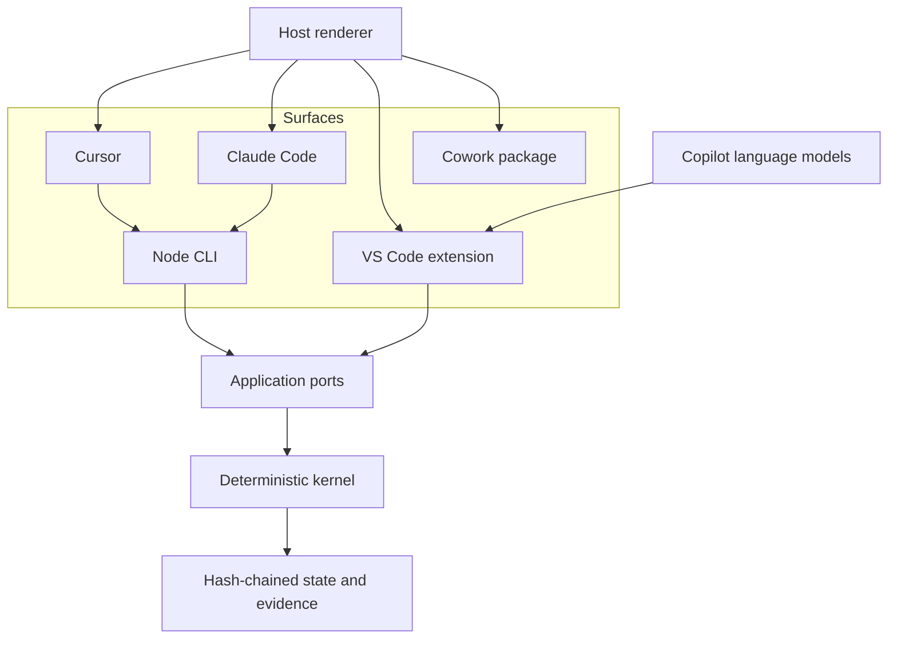

<!-- Purpose: Select the cross-surface execution architecture that turns HVE-Forge into a working coding harness. -->

# ADR-004: Cross-Surface Execution and Provider Architecture

**Status:** Accepted for phased implementation; security order amended after release review
**Date:** 2026-09-02
**Author:** GitHub Copilot
**Council:** `docs/artifacts/adr/COUNCIL-004-cross-surface-execution.md`
**Builds on:** `ADR-003` (canonical assets, typed host renderers, TypeScript kernel). Its invariants remain normative.

## Context

HVE-Forge 0.2 is a deterministic control plane with a proven safety kernel, but it cannot perform real coding work. The independent review recorded three blocking gaps: no live model provider, exactly one registered tool, and a hard-wired single-decision loop. A fourth constraint follows from them: enabling execution without isolation would be the highest-risk configuration in the design.

Two mature harnesses were studied for reusable concepts.

**AgentX** contributes role contracts with explicit pipelines and done criteria, six shared lifecycle checkpoints, risk-based quality-loop minimums with structured reviewer verdicts, compound capture of durable learning, zero-copy workspace initialization, and a layered model-adapter strategy in which GitHub Copilot is the default VS Code experience and API keys are optional rather than required.

**gstack** contributes a one-config-file host adapter pattern, a working-tree content fingerprint that survives commits and rebases, an evidence ledger that grades verification FRESH/STALE/MISSING against that fingerprint, hash-chained egress receipts written before any off-machine send, a trust envelope that labels untrusted tracker text so agents treat it as data, a verify gate that blocks turn completion until a declared command passes and yields loudly after three blocked attempts, and a stop-after-three-failed-fixes investigation rule.

The decisive external fact is the VS Code Language Model API. An extension can select Copilot-vendor chat models after a user-consent dialog and stream a response. Consent and credentials are owned by VS Code, not by the harness. This removes credential custody, spend authorization, and key storage from the default path entirely.

## Decision

Generalize execution behind existing ports and add surface adapters rather than a second runtime.

1. The model provider port becomes message-and-tool-call based instead of returning one fixed decision. `RecordedProvider` continues to satisfy it as the offline test double.
2. Tools become a registry of capability-classed adapters behind the existing deny-by-default policy. Each tool declares a capability class, from which the policy action class is derived, and remains unregistered until policy admits it.
3. The single-decision workflow becomes a bounded agent loop terminated by budgets, completion criteria, oscillation detection, and a stop-after-three-failed-fixes rule.
4. A VS Code extension becomes the default interactive surface. It supplies a model provider backed by the VS Code Language Model API restricted to the Copilot vendor, and composes the bundled kernel. No API key is required for the default path.
5. The extension is built exclusively on built-in VS Code extension APIs and adds no runtime dependency and no bundler. Model inference, token accounting, tool exposure, chat, MCP discovery, file access, watching, secrets, settings, state, logging, progress, and diagnostics are all obtained natively, as is Git state wherever the built-in Git extension is present. Capabilities with no usable native API are recorded as limits and deferred rather than solved with a package; SPEC-004 section 6.5 holds the authoritative list.
6. Cursor and Claude Code continue to consume generated agents, skills, and rules; both also reach the kernel through the existing CLI.
7. Cowork becomes a package render target, not a scan-path host. The renderer emits an upload-ready Microsoft 365 app package from the same canonical catalog.
8. Execution capability beyond workspace writes stays fail-closed until an isolation backend is registered.
9. Adopt from gstack: working-tree fingerprint, evidence freshness grading, egress receipts, untrusted-text envelopes, and a verify gate.
10. Adopt from AgentX: lifecycle checkpoints, risk-based loop minimums with attributable reviewer verdicts, compound capture, and zero-copy initialization.
11. Canonical distribution assets resolve only from the installed package or extension location. The target workspace is untrusted task input and can never select the catalog, policy, schemas, prompts, profiles, or evaluator rubric.
12. Generated host customizations remain declarative until every write, process, browser, and network effect is demonstrably mediated by the kernel. Default generated agents receive no native privileged tools.

## Options Considered

### Option A: Standalone runtime with direct provider HTTP clients

Full control and editor independence. Requires the harness to take custody of API keys, obtain spend authorization, and build its own consent UX. Rejected as the default; retained as an optional adapter behind explicit approval.

### Option B: VS Code extension supplying Copilot through the Language Model API

The editor owns authentication, consent, quota, and model selection. The harness never sees a credential. Works for any user who already has Copilot. Selected as the default surface.

### Option C: MCP server only

Good tool interop, but MCP does not carry the instruction, agent, rule, or lifecycle plane, and cannot supply the model. Retained as a future optional tool plane, rejected as the execution architecture.

### Option D: Shell out to installed vendor CLIs

Fast to reach several vendors, but the contract is a process boundary with unstable text output, no typed tool-call protocol, and no consent story the harness controls. Rejected as the primary path.

### Option E: Options B and A layered behind one port, with C as an optional tool plane

Selected. Copilot via the extension is the default; direct API adapters remain available under explicit approval; MCP remains a future tool plane.

## Architecture

The kernel gains no new dependency. Every surface is a composition root over the same ports.

## Surface Matrix

| Surface | Agents and skills | Rules | Model provider | Current tier | Target tier |
|---|---|---|---|---|---|
| VS Code | `.claude/agents`, `.claude/skills` | `.github/instructions` | **GitHub Copilot via the Language Model API (default)** | Declarative | Kernel-mediated after the extension owns all effects |
| Cursor | `.claude/agents`, `.claude/skills` | `.cursor/rules` | CLI adapter | Declarative | Kernel-mediated only through a proven adapter |
| Claude Code | `.claude/agents`, `.claude/skills` | `.claude/rules` | CLI adapter | Declarative | Kernel-mediated only through a proven adapter |
| Cowork | packaged `skills/<name>/SKILL.md` | none | host-managed | Declarative | Declarative |
| Agent Skills clients | `.agents/skills` when rendered alone | none | none | Declarative | Declarative |

## Non-Negotiable Invariants

ADR-001 and ADR-003 invariants remain. Add:

16. The default VS Code path requires no API key and no harness-held credential.
17. Every tool declares a capability class, from which its policy action class is derived, and remains unregistered until deny-by-default policy admits it.
18. Loop termination is budget-bound and evidence-bound; no unbounded iteration exists.
19. Verification evidence is graded against a working-tree fingerprint and is invalid when stale.
20. Any off-machine send writes a hash-chained receipt before the send.
21. Untrusted external text is enveloped and labeled as data before it reaches a prompt.
22. Process, network, and browser capabilities stay unregistered until an isolation backend is present.
23. The VS Code extension adds no runtime dependency and no bundler. Every capability maps to a built-in extension API or to a recorded limit, and the extension loads the same compiled kernel as the CLI rather than an independently resolved copy. Type definitions and packaging tooling are development-only, never ship in the artifact, and do not count against this invariant.
24. Distribution identity and target workspace identity are separate. Only module-relative, hash-bound package assets can define harness authority.
25. Trust envelopes and origin metadata exist before repository reads can enter any live provider request. A durable provider-egress receipt is flushed before every live model send.
26. Default host artifacts grant no native write, process, browser, or network capability while their enforcement tier is declarative.

## Consequences

### Positive

- Copilot as default removes the credential and spend barrier for the largest surface.
- One canonical catalog now reaches five surfaces including Cowork.
- Tools, loop, and provider all land behind ports that already exist and are already tested.
- Borrowed gstack primitives close real gaps in evidence freshness and untrusted-input handling.
- Building only on built-in APIs keeps the whole product at zero runtime dependencies, so the existing supply-chain gate covers the extension without extension-specific policy.

### Negative

- The VS Code extension is a second build target with its own packaging and test story.
- The Language Model API cannot be exercised in unit tests; the provider needs a seam and a fake.
- A multi-decision loop widens the blast radius of every tool and requires oscillation controls that do not exist yet.
- Cowork's managed container forbids terminal use, so its rendered skills must be instruction-only.
- Refusing packages costs real capability. Workspace-wide text search has no stable extension API, so search is rebuilt over file discovery plus bounded reads. There is no extension-facing diff API. Telemetry has a native logger but no native transport, so it is deferred. Contributed tool input must be validated by hand rather than by a schema library. Git state depends on an optional built-in extension that must degrade gracefully. Shipping unbundled produces a larger install than a bundled extension.
- The consumed contribution points impose a minimum host version, which narrows the addressable user base to reasonably current VS Code installations.

## Implementation Sequence

1. Resolve canonical assets from the installed distribution and prove packed initialization against a hostile target.
2. Remove native privileged tools from default host artifacts and report declarative security readiness honestly.
3. Implement trust envelopes, origin metadata, bounded context assembly, and provider-egress intent.
4. Add read, list, and literal-search tools and route every tool through one immutable dispatcher.
5. Generalize the provider port to bounded atomic turns while preserving recorded fixtures and v1 replay.
6. Add the durable bounded loop with oscillation, repeated-signature, cancellation, and three-failed-fix termination.
7. Grade evidence against a full relevant working-tree fingerprint that includes untracked files.
8. Add the native VS Code extension and Copilot provider; flush an egress receipt before each model request.
9. Add the instruction-only Cowork package target.
10. Complete release metadata, installed-consumer tests, cross-platform CI, provenance, and rollback evidence.
11. Select and approve isolation before adding execute-class tools; add network-tool receipts before any network tool.

Steps 1 through 10 add no runtime dependency. Step 11 requires a separate threat-model decision and exact human approval. MCP transport, direct provider APIs, process tools, and network tools remain deferred.

## Release Gates

- Zero runtime dependencies across the kernel and every surface; the extension consumes only host-provided APIs. Development-only type definitions and packaging tooling are exempt because they never ship.
- No bundler is introduced. Extension-host code stays thin enough to be covered by kernel and application tests; logic that cannot be covered that way is a design defect rather than a reason to add a runner.
- Aggregate and per-layer coverage remain at or above 80 percent.
- Copilot provider unit-tested against a fake `LanguageModelChat`; no live model call in CI.
- Loop termination proven by property tests over budget and oscillation inputs.
- Cowork packages validate against the documented manifest and folder contract.
- No execute-class tool registered without an isolation backend and recorded approval.
- Packed consumers initialize unrelated and hostile target workspaces without an internal source-root argument.
- Current host security readiness is never reported as mediated while native privileged tools can bypass the kernel.
- Release evidence binds the exact clean commit, package digest, SBOM, reviewer verdict, and CI attestation.

## References

- [AgentX](https://github.com/jnPiyush/AgentX)
- [gstack](https://github.com/garrytan/gstack)
- [VS Code Language Model API](https://code.visualstudio.com/api/extension-guides/ai/language-model)
- [VS Code Language Model Tool API](https://code.visualstudio.com/api/extension-guides/ai/tools)
- [Agent Skills specification](https://agentskills.io/specification)
