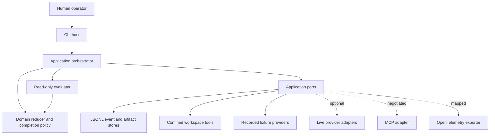
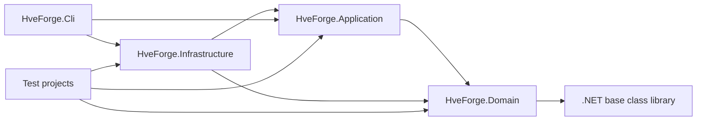
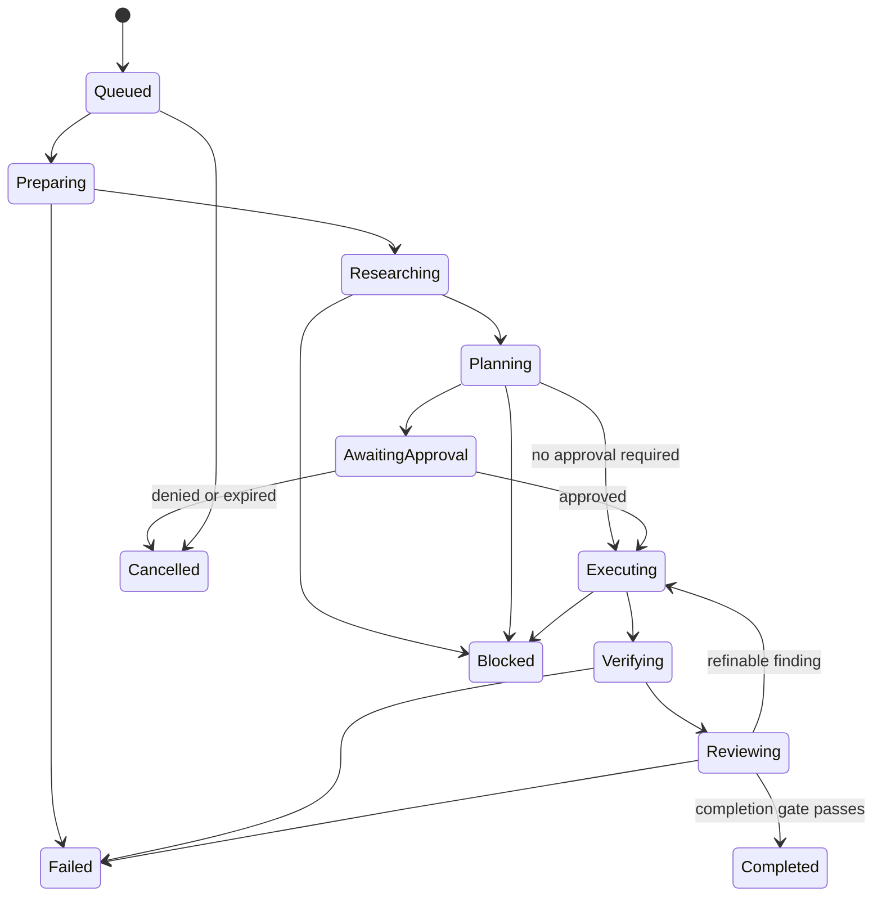

<!-- Purpose: Implementation specification for the HVE-Forge production AI coding harness. -->

# Technical Specification: Production AI Coding Harness

**Status:** Approved for local thin-slice implementation
**Author:** AgentX Architect
**Date:** 2026-08-31
**Issue:** https://github.com/jnPiyush/HVE-Forge/issues/2
**Related ADR:** `docs/artifacts/adr/ADR-001-harness-runtime.md`
**Related council:** `docs/artifacts/adr/COUNCIL-001-harness-runtime.md`
**Related threat model:** `docs/security/ai-coding-harness-threat-model.md`
**Related contract:** `docs/execution/contracts/CONTRACT-001-policy-replay-kernel.md`
**Runtime evaluator contract:** `config/contracts/exact-text-replacement.v1.json`

## 1. Overview

HVE-Forge is a modular .NET 10 control plane for bounded coding-agent tasks. A deterministic kernel owns lifecycle transitions, policy, durable events, replay, evidence freshness, and completion. Model providers, tools, stores, isolation backends, protocol clients, telemetry exporters, and user surfaces are adapters around that kernel.

The first executable release is credential-free and local-only. It proves the policy/replay/evidence boundary with recorded model fixtures and a confined text-replacement tool. It explicitly does not claim process, network, container, microVM, production, or cross-provider isolation.

### 1.1 Success criteria

- A clean checkout restores and builds with a pinned SDK and locked dependencies.
- One CLI command runs a fixture task and emits ordered structured events.
- Interrupted fixture runs resume without duplicate effects.
- Replay validates the event chain and invokes no provider or tool.
- Hostile paths, unknown tools, stale evidence, tampered events, repeated actions, and exhausted budgets fail closed.
- Completion requires fresh final hashes and a read-only evaluator verdict.
- Core Domain, Application, and Infrastructure line and branch coverage stay at or above 80 percent.

### 1.2 Selected stack

| Concern | Selection | Version | Verification source/date | Rationale |
|---|---|---:|---|---|
| Runtime | .NET SDK and C# | 10.0.111 / C# 14.0 | Local SDK, 2026-08-31 | Installed, strongly typed, cross-platform, stable BCL primitives |
| Architecture | Modular monolith | n/a | ADR-001, 2026-08-31 | Lowest operational burden that preserves module boundaries |
| Host surface | Console CLI plus application service API | v1 | This specification | Scriptable and reconnectable without premature web UI |
| Persistence | Append-only UTF-8 JSONL and artifact files behind ports | Schema v1 | This specification | Inspectable, hashable, replayable, replaceable |
| Serialization | `System.Text.Json` | .NET 10 | SDK/BCL | No external production dependency |
| Cryptography | SHA-256 and HMAC-capable BCL interfaces | .NET 10 | SDK/BCL | Standard primitives; no custom cryptography |
| Test framework | xUnit, test SDK, coverlet collector, JsonSchema.Net | 2.9.3, 17.14.1, 6.0.4, 9.4.0 | Installed SDK template and configured package feed, 2026-08-31 | Compatible local baseline; schema validator remains test-only; CI must revalidate |
| Observability | Stable internal vocabulary plus optional OpenTelemetry adapter | Internal v1; external mapping pinned later | OTel research, 2026-08-31 | Isolates changing GenAI conventions |
| Model integration | Provider-neutral port with recorded fixtures first | Contract v1 | ADR-001 | Prevents credentials, spend, and SDK coupling in the kernel |
| MCP | Versioned adapter and conformance fixtures | Baseline 2026-07-28 | MCP release research, 2026-08-31 | Capability negotiation without core protocol coupling |
| CI | GitHub Actions | Pinned action SHAs before release | Repository platform | Restore, build, test, security, SBOM, and packaging gates |

## 2. Architecture

### 2.1 Container view

### 2.2 Dependency direction

The Domain project references no production project or provider/storage/UI/OS package. Application references Domain only. Infrastructure implements Application ports. CLI is the composition root. Architecture tests inspect project references and namespaces.

### 2.3 Lifecycle

Every visible transition is represented by a durable event before the host acknowledges it. Terminal statuses are Completed, Blocked, Failed, and Cancelled. Resume reconstructs state from events and reconciles idempotent effects.

## 3. Domain contracts

Every contract carries `schemaVersion`, stable ID, ownership/correlation IDs, timestamps in UTC, and explicit status. Identifiers are ASCII and length-bounded. Risk uses one ordered vocabulary: `low`, `medium`, `high`, and `critical`. Budget counters use `decisions` and `toolDispatches` consistently.

| Contract | Required responsibility |
|---|---|
| Task | Immutable objective, owner, risk, budgets, contract reference, requested capabilities |
| Thread | Durable task conversation identity and current run lineage |
| Turn | One bounded model decision cycle with input/output references |
| Item | Typed message, decision, tool request, approval, evidence, or result reference |
| ToolCall | Tool name/version, validated redacted arguments, policy decision, idempotency key, timing, result reference |
| WorkContract | Scope, non-scope, acceptance, verification, risks, recovery, version/hash |
| Checkpoint | Projection/event head, workspace hash, open findings, next action, budget snapshot |
| Artifact | Content-addressed metadata and storage reference; large bytes remain outside events |
| Evidence | Producer, command/action, cwd, start/end, expected/observed, exit status, artifact hashes, source commit, freshness |
| PermissionDecision | Action class, normalized target, applicable rules, deny/allow result, human decision reference |
| AgentRun | Effective provider/model/effort, prompt/skill/policy versions, sandbox, limits, status, usage |
| EvaluationRun | Evaluator identity, read-only capability proof, rubric version, final hashes, findings, verdict |

Machine-readable schema files live under `schemas/v1/`. Runtime types are authoritative for execution; JSON Schema artifacts are interoperability and fixture-validation contracts parity-tested against runtime records with test-only JsonSchema.Net 9.4.0. Schemas for future approval, handoff, work-contract ingestion, and live provider capabilities are reserved design contracts and cannot be emitted by the slice-1 event registry.

## 4. Event and replay contract

An event envelope contains schema version, run ID, contiguous sequence, event type, UTC occurrence time, canonical JSON payload, previous hash, and event hash. Event hash is SHA-256 over the canonical envelope excluding `eventHash`. The first event uses a fixed all-zero previous hash.

Hash-bound JSON uses `HVE Canonical JSON v1`, a deliberately restricted canonical form rather than unrestricted JSON. It supports objects, arrays, strings, signed 64-bit integers, booleans, and null. It rejects duplicate object names, floating-point and exponent numbers, invalid Unicode, and configured depth or byte-limit violations. Object names are sorted using .NET ordinal ordering, arrays retain input order, and strings are emitted with `Utf8JsonWriter` default escaping without Unicode normalization or insignificant whitespace. Monetary values are integer minor units. Golden vectors under `tests/fixtures/canonical-json-v1/` freeze exact bytes and hashes.

Event hashes are computed from the canonical envelope with `eventHash` omitted, not set to null. The slice-1 event registry is closed to: `run.created`, `state.transitioned`, `instruction.selected`, `provider.decision_recorded`, `policy.decision_recorded`, `tool.dispatched`, `tool.completed`, `checkpoint.recorded`, `verification.recorded`, `evaluation.recorded`, `run.interrupted`, `run.cancelled`, `run.blocked`, `run.failed`, and `run.completed`.

Raw physical timestamps and run IDs may differ between fresh runs. The semantic trace digest includes each event's `sequence`, `eventType`, and normalized stable payload. It excludes envelope `runId`, `occurredAt`, `previousHash`, and `eventHash`, plus physical hashes derived from them: checkpoint `checkpointHash`, `projectionHash`, and `chainHeadBefore`; verification `artifactHash`; evaluation `artifactHash` and `projectionHash`; and completion `projectionHash`. Physical events retain and validate those exact bindings. Other payload values never contain physical temp roots or wall-clock timestamps.

Projection `updatedAt` is derived only from the final applied event's `occurredAt`; reducers never read the wall clock. When scoped instruction discovery finds no `AGENTS.md`, `instruction.selected` uses a null relative path, byte length zero, and the SHA-256 of empty bytes (`e3b0c44298fc1c149afbf4c8996fb92427ae41e4649b934ca495991b7852b855`) as the absence sentinel.

Append validates expected next sequence and previous head under a run lease, flushes to durable storage, then returns. Replay rejects unknown schema versions, malformed JSON, duplicate/gapped sequence, previous-hash mismatch, event-hash mismatch, invalid transitions, or unsupported event types. Replay uses fail-if-called provider/tool ports.

## 5. Tool and policy contract

### 5.1 Tool boundary

Each tool performs one action and declares name, semantic version, action class, strict input schema, timeout, cancellation behavior, output limit, and idempotency behavior. Tool results are data with `ok`, typed error code, safe message, retryability, retry delay, artifact reference, and bounded summary. No raw shell command is a tool in the local MVP.

Arguments are validated before policy and immediately before dispatch. Policy is data-driven, deny-by-default, deny-overrides-allow, and fail-closed if unavailable. Model output and repository configuration cannot relax organization policy.

### 5.2 Initial capabilities

| Capability | Class | MVP status |
|---|---|---|
| Exact text replacement | workspace_write | Allowed for existing regular files under workspace with idempotency key |
| Repository map/read/search | read | Deferred to the next slice; fixture decisions are recorded and deterministic |
| Process/shell/test runner | privileged | Not registered in first kernel slice |
| Network/browser | external_write or privileged | Not registered |
| Git remote/deploy/release | external_write/destructive | Not registered |
| Secret access | secret_bearing | Not registered |

### 5.3 Path safety

The workspace tool accepts relative paths only. It rejects rooted, drive-relative, UNC, device, alternate-data-stream, traversal, control-character, invalid-character, symlink, junction, and reparse-point paths. Canonical containment uses Windows semantics in the acceptance environment and rechecks immediately before atomic replacement. This is workspace confinement, not protection against a privileged concurrent local attacker.

## 6. Host and approvals

The initial CLI supports `run`, `inspect`, `stream`, `pause`, `resume`, `retry`, `fork`, `replay`, `cancel`, and `archive`. `stream` is finite polling: it returns events after a caller-supplied sequence and exits; persistent subscriptions and reconnect semantics are deferred. Output is newline-delimited JSON. Exit codes follow the active work contract.

Approval records include exact normalized action, class/risk, target resources, redacted arguments, expected effect, alternatives, expiry, requester identity, and real approver identity. Agent messages never count as approval. The local MVP contains no action that an approval can elevate into process, network, secret, destructive, or remote execution.

## 7. Context, instructions, prompts, and skills

- Discover `AGENTS.md` from the target directory toward the workspace root; nearest scope wins and conflicts are diagnostic.
- Record source, relative scope, precedence, trust class, byte length, SHA-256, and effective selection.
- Load skill metadata first, instructions only after deterministic activation, and referenced resources only on demand.
- Validate frontmatter, path containment, size, references, provenance, license, compatibility, and allowed-tool metadata.
- Repository text, prompt text, skills, and tool output are untrusted content and cannot change policy.
- Prompts, policy, tool schemas, skills, and evaluator rubrics are separate versioned assets with hashes attached to runs.
- Compaction, structured memory, and reset/handoff are distinct operations. The reset packet is schema-validated and must let a clean worker resume without chat history.

## 8. Provider and MCP adapters

The provider port normalizes request/response streaming, structured output, tool calls, usage, cancellation, errors, capabilities, opaque reasoning references, and requested/served model identity. Unsupported capabilities are explicit. Live adapters cannot silently drop a field or weaken a schema.

Two recorded provider fixture adapters with different capability matrices must pass the same contract tests before the adapter API is considered stable. Provider-neutral production claims require two live adapters and explicit budget/compliance approval.

The MCP adapter pins a dated protocol baseline and exposes a conformance matrix. Baseline 2026-07-28 tests per-request version/capability metadata, discovery negotiation, result types, multiple-round-trip input requests/state integrity, subscriptions, cursor TTL/cache scope, JSON Schema 2020-12 with remote references disabled, explicit handles, progress, cancellation, errors, elicitation/consent, and hardened OAuth metadata/issuer/audience behavior for protected HTTP. Tasks and other extensions are negotiated feature flags.

## 9. Evidence and completion

Evidence records command/action, a run-relative working directory, producer, start/end, expected and observed result, named criterion checks, exit code, discovered test count, cache status, source fixture hash, optional source commit, policy/instruction/provider hashes, artifact hashes, event head, and freshness. `sourceCommit` is null for a copied non-Git fixture and required by host policy only when the source is a Git worktree. Raw evidence is content-addressed; summaries are bounded.

The independent evaluator is an Application service that depends only on the exact parsed runtime work contract, immutable Domain projection, rubric, and named evidence values. It receives no event store, workspace, dispatcher, mutable filesystem, process, network, provider, approval, or secret port. Its capability object is a declaration for audit output, not proof; architecture tests prove the absence of forbidden project references and constructor dependencies. The bounded runtime requires the complete four-criterion contract and complete ten-dimension rubric, so caller-supplied subsets cannot weaken approval. The orchestrator alone appends its verdict event.

Completion passes only when required evidence is present and fresh for the final file/event hashes, built-in verification discovered and passed at least one contract check, test discovery is nonzero where executable tests are required, passing counts do not decline, evaluator is read-only, and no critical/high or material-medium finding remains. Any later mutating event invalidates the verdict.

## 10. Observability and economics

The internal hierarchy is Task -> AgentRun -> Turn -> ModelCall/ToolCall/Handoff/Evaluation. Metadata includes correlation IDs, role, requested/served model, effort, prompt/skill/policy/tool versions and hashes, decision, latency, usage, normalized cost, cache state, error class, evidence links, compactions, resets, retries, loops, and approvals.

Default telemetry is metadata-only. Secret and PII redaction occurs before persistence or export. Content capture is opt-in and requires separate encryption, authorization, retention, regional-storage, and deletion policy. OpenTelemetry mapping is isolated in a versioned exporter because GenAI semantic conventions are not assumed stable.

## 11. Security controls

The threat model is normative. The initial runtime has no ambient credential import, dynamic plugin loading, arbitrary command execution, network egress, or remote writes. Public records store typed secret references only. Policy files, prompts, skills, hooks, MCP configuration, shell startup files, git controls, and credential stores are protected paths.

Future isolation backends must enforce non-administrator execution, filesystem allowlists, task temp scope, CPU/memory/disk/process/time/output limits, deny-by-default egress, redirect/DNS validation, and destination-scoped credential brokering. Policy plus OS enforcement are both required; either unavailable means dispatch is denied.

## 12. Verification strategy

- Unit: reducers, transitions, canonicalization, hashing, schemas, policy rules, budgets, signatures, freshness, redaction, stop conditions.
- Property/adversarial: event round-trip, chain tampering, path normalization, hostile Unicode/control input, structured-output bounds, parser fuzz seeds.
- Integration: event persistence/order, workspace copying, atomic replace, cancellation, idempotency, checkpoints, resume, archive, and optional real NTFS reparse rejection.
- End-to-end: CLI fixture, interruption at three boundaries, double resume, deterministic trace, replay with fail-if-called effects.
- Architecture: project references, forbidden dependencies, evaluator port isolation, and reserved-schema non-emission.
- Security: secret canaries, path escapes/reparse points, malicious tool/model output, policy unavailable, output floods, retry storms.
- Eval: versioned private fixtures, temporal task metadata, objective checks first, judge-human calibration before judge gating.

## 13. Rollout and compatibility

1. Release the fixture-backed local kernel as an explicit preview package after all local gates pass.
2. Add process/container isolation only when a supported backend is available and independently threat-tested.
3. Add one live provider behind explicit operator configuration, then a second provider and conformance comparison.
4. Add MCP core after its dated contract suite passes; keep optional extensions disabled by default.
5. Add IDE/web surfaces only after the CLI contract stabilizes and accessibility requirements are designed.

Schema, prompt, policy, tool, evaluator, provider, MCP, and telemetry adapter versions evolve independently. Readers must reject unsupported major versions rather than guessing compatibility.

## 14. Open production decisions

- Primary and fallback live providers/models, immutable snapshots, data residency, and retention.
- Per-task and monthly budget ceilings and latency objectives.
- Required compliance framework and tenant/identity model.
- Container versus microVM backend and target operating systems beyond the Windows acceptance environment.
- Managed hosting, database, key management, and production observability destination.

These decisions block production deployment and live model execution, but do not block the fail-closed local kernel.
