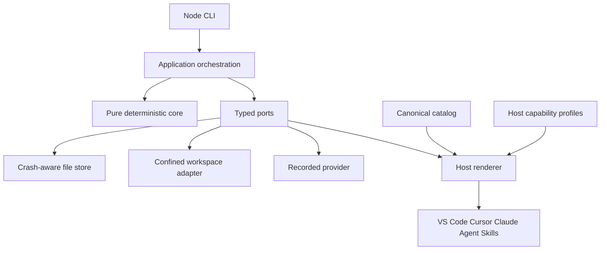

<!-- Purpose: Define implementation contracts for the cross-editor TypeScript harness. -->

# Technical Specification: Cross-Editor TypeScript Harness

**Status:** Approved for implementation
**Author:** GitHub Copilot
**Date:** 2026-09-01
**Related ADR:** `docs/artifacts/adr/ADR-003-cross-editor-typescript-harness.md`
**Related plan:** `docs/execution/plans/EXEC-PLAN-003-cross-editor-typescript.md`

## 1. Overview

HVE-Forge provides one dependency-minimal Node CLI, one deterministic kernel, and one canonical customization catalog. Typed renderers generate compatible artifacts for VS Code, Cursor, Claude Code, and generic Agent Skills clients without changing policy semantics or maintaining independent authored copies.

### Scope

- Node CLI for run lifecycle, rendering, drift checks, diagnostics, and offline MCP validation.
- Deterministic policy, event, replay, evidence, approval, budget, and completion kernel.
- Canonical agents, rules, routers, skills, host capability profiles, and generated manifests.
- Windows, macOS, and Linux quality validation.
- Recorded providers and one idempotent confined text-replacement tool only.

### Out of Scope

- Live model calls, arbitrary shell, browser automation, network tools, remote writes, or deployment.
- Trusting host prompts or hooks as a sandbox.
- Changing `schemas/v1` during the language migration.
- Installing executable repository hooks without explicit operator approval.

### Success Criteria

- `hve init`, `render`, `render --check`, `doctor`, lifecycle, diagnostics, and offline MCP commands are implemented in TypeScript.
- Every generated file is deterministic, manifest-owned, and conflict-safe.
- Each supported host discovers no more than one logical copy of each catalog item.
- Existing canonical JSON vectors, event/replay constraints, policy decisions, and completion constraints pass in Node.
- Required checks run without .NET on Node 24 across Windows, macOS, and Linux.

## 2. Selected Technology Stack

| Concern | Selection | Version | Verification source and date |
|---|---|---:|---|
| Runtime | Node.js LTS, ESM | 24.x, local 24.14.0 | Node release policy and local executable, 2026-09-01 |
| Language | TypeScript strict mode | 7.0.2 | TypeScript documentation and npm registry, 2026-09-01 |
| Package manager | npm with exact lockfile | 11.9.0 | Local executable, 2026-09-01 |
| Tests | Vitest and V8 coverage | 4.1.11 | Vitest documentation and npm registry, 2026-09-01 |
| Static quality | Biome | 2.5.10 | Biome documentation and npm registry, 2026-09-01 |
| Runtime dependencies | Node standard library | none | Architecture requirement |
| Data store | Local UTF-8 JSON/JSONL | schema v1 | Existing frozen contracts |
| CI | GitHub Actions matrix | Windows, macOS, Linux | Repository delivery target |

## 3. Architecture

Dependency direction is enforced by an import-boundary test:

- `src/core` imports only Node crypto where hashing is required and never imports application/runtime/CLI modules.
- `src/application` imports core contracts and declares ports.
- `src/adapters` implements ports and may import core/application.
- `src/cli` is the composition root.
- `src/hosts` owns pure host profiles and rendering; it does not own policy decisions.

## 4. Core Contracts

### 4.1 Canonical JSON

- UTF-8 input and output are limited to 1 MiB and depth 64 by default.
- Object keys use ordinal UTF-16 code-unit order compatible with the frozen vectors.
- Duplicate properties, trailing input, comments, fractions, exponents, out-of-range signed 64-bit integers, and unpaired surrogates are rejected.
- Strings use the existing escaped representation, including escaping quotation marks as `\u0022`.
- All integrity hashes are lowercase SHA-256 over canonical UTF-8 bytes.

### 4.2 Event and Replay

- Event schema remains `1.0`; event names and envelope fields remain frozen.
- Event hashes exclude `eventHash`, include the prior hash, and bind UTC round-trip timestamps.
- Sequence starts at one, remains contiguous, and begins with `run.created`.
- Replay performs no provider, tool, or host call and rejects unknown or malformed data.
- Terminal runs reject later events; singleton event constraints remain unchanged.

### 4.3 Policy and Approval

- Policy defaults to deny; a matching deny overrides every allow.
- Wildcard allow rules are invalid.
- Only `workspace.replace_exact_text` is registered initially.
- External-write, destructive, privileged, and secret-bearing actions require exact, unexpired approval from a `human:*` identity in addition to policy allowance.

### 4.4 Budgets and Completion

- Decision, dispatch, elapsed time, input token, output token, and cost limits are validated before and after relevant boundaries.
- Completion requires fresh non-cached verification, no test regression, exact final workspace/projection/event bindings, a strictly read-only evaluator, and zero unwaived Critical/HIGH/MEDIUM findings.

## 5. Host Rendering Contract

### 5.1 Canonical Inputs

Each catalog item has a stable ID, kind, source path, target-specific metadata, and declared required capabilities. Canonical assets remain under `hve/`, outside every host scan path. Agent Skills retain valid `SKILL.md` frontmatter and progressive disclosure. Canonical rules do not contain host-specific path or tool syntax.

For a multi-host VS Code/Cursor/Claude target, agents and skills are emitted once under `.claude/agents` and `.claude/skills`. All three hosts document those compatibility paths. This prevents the same logical item from being loaded twice by hosts that scan both native and compatibility paths.

Shared agent frontmatter uses Claude tool allowlists, which VS Code maps to its tools, and adds Cursor's `readonly: true` for every catalog role without edit authority. Unsupported host fields are advisory; trusted policy and mutation authority remain kernel-owned.

### 5.2 Host Profiles

Each versioned host profile declares scanned paths, output paths, supported frontmatter, lifecycle hooks, permission behavior, MCP configuration path, and enforcement tier. Unknown required capabilities fail rendering unless the operator explicitly requests advisory degradation.

### 5.3 Manifest and Ownership

The manifest records schema version, renderer version, profile versions, source hashes, output hashes, logical IDs, and generation timestamp exclusion from deterministic content. Rendering computes all output bytes before mutation and writes each file through a same-directory temporary file plus rename. Source, target, manifest, scan, write, and delete paths reject links and reparse points in existing ancestors. Existing unknown files and locally edited generated files are conflicts. Obsolete manifest-owned files are deleted only by an explicit update operation. Multi-file replacement is not an atomic transaction; a rerun reconciles completed files against the manifest and source hashes.

### 5.4 Duplicate Discovery

The renderer computes the effective scan set for every host profile and groups artifacts by logical ID. Diagnostics scan actual host discovery roots, not only manifest entries, and identify known unmanaged copies by generated provenance or unambiguous frontmatter names. More than one scanned output for one logical ID is an error. Shared portable paths are preferred over redundant host copies when the host supports them.

## 6. Filesystem and Persistence

- All external paths are resolved from an explicit repository, run, or workspace root, and every existing ancestor from the filesystem root is rejected if it is a link or reparse point.
- User target paths must be non-empty relative paths without traversal, drive, device, control, wildcard, ADS, or reparse components.
- A target is rechecked immediately before replacement.
- Files must be strict UTF-8 regular files and the expected text must occur exactly once.
- Replacement and receipts use same-directory temporary files, flush, close, and atomic rename.
- Event append is serialized by a lock file, flushed before acknowledgement, and followed by a derived projection write.
- Event leases bind PID, random token, acquisition, and a fixed ten-minute expiry. Dead owners are reclaimed immediately; expiry provides bounded recovery when a PID is reused on platforms without process-birth identity.
- Workspace and source manifests exclude private `.hve-control` state and hash sorted path/hash entries.
- Sensitive replacement strings are stored only in authenticated encrypted local control data; public records contain hashes.

## 7. CLI Contract

The CLI preserves `run`, `submit`, `resume`, `retry`, `fork`, `pause`, `cancel`, `inspect`, `replay`, `stream`, `instructions`, `skills`, `mcp`, `handoff`, `reset`, `approval`, `archive`, `help`, and `version`. It adds `init`, `render`, `render --check`, `doctor`, and `update`.

Commands emit one-line JSON records except help/version. Exit codes remain 0, 2 through 11 with their frozen meanings. Invalid invocation and malformed persisted data produce sanitized stderr and no stack trace unless an explicit debug environment flag is enabled.

## 8. Runtime Validation

Every external JSON object is decoded as `unknown`, checked for exact allowed properties, validated recursively, and converted to a typed internal value. This applies to policies, provider fixtures, contracts, rubrics, host profiles, manifests, metadata, events, handoffs, receipts, MCP messages, verification, and evaluation artifacts.

No runtime validator may fetch remote references. Inputs are bounded before parsing.

## 9. Testing Strategy

| Layer | Required coverage |
|---|---|
| Pure core | Canonical vectors, property tests, event tamper matrix, transition table, policy deny precedence, budget and completion boundaries |
| Adapters | path traversal/reparse/UTF-8 tests, idempotency crash states, torn events, metadata rebinding, generated-file conflicts |
| Host rendering | snapshots for all profiles, duplicate discovery, capability loss, deterministic rerender, orphan and user-file protection |
| CLI/E2E | run/resume/replay/handoff/archive plus render/check/doctor workflows and exit codes |
| Cross-platform | line endings, path case behavior, separators, atomic replace, and host snapshots |

Aggregate and per-layer statement, branch, function, and line coverage must each be at least 80 percent for core, application, adapters, hosts, and CLI. Randomized tests use reported seeds and bounded input sizes.

## 10. Security and Supply Chain

- `.npmrc` sets `ignore-scripts=true`; CI uses `npm ci --ignore-scripts`.
- All direct versions are exact and the lockfile is committed.
- The project pins the approved Microsoft npm mirror; every exact tarball URL is allowlisted and every lockfile/SBOM component uses SHA-512 integrity plus license metadata.
- Runtime dependencies remain zero until a separate review proves necessity.
- Release gates include npm audit, license inventory, secret scan, SBOM, package content allowlist, and provenance.
- Generated hooks are disabled or advisory by default and require explicit operator opt-in.
- Host capability reports never claim sandbox strength the host cannot provide.

## 11. Rollout and Recovery

1. Renderer and doctor ship while the frozen runtime remains an oracle.
2. TypeScript core consumes frozen vectors and persisted fixtures offline.
3. TypeScript becomes the only documented and CI runtime after all parity gates pass.
4. .NET source/build artifacts are removed from the active branch; Git history and a frozen tag remain the recovery source.

Runtime prompt, skill, contract, rubric, policy, and provider capability hashes are derived or verified against exact confined regular-file bytes and persisted assets before execution and replay. Event payloads are exhaustively validated by event type before hashing or reduction. Event leases use PID-owned, token-bound records and recover after owner death or validated bounded expiry; future-dated acquisition outside one minute of clock skew is invalid.

Any unexplained hash, replay, policy, evidence, or path-safety divergence blocks cutover.

## 12. Open Questions

- Native host CLI smoke tests are conditional on those products being installed in CI.
- Process/network isolation remains unsupported until an explicit sandbox backend decision.
- Live providers remain unsupported until model, data-governance, credential, and budget decisions exist.
