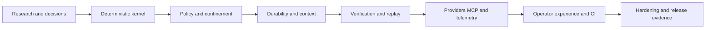
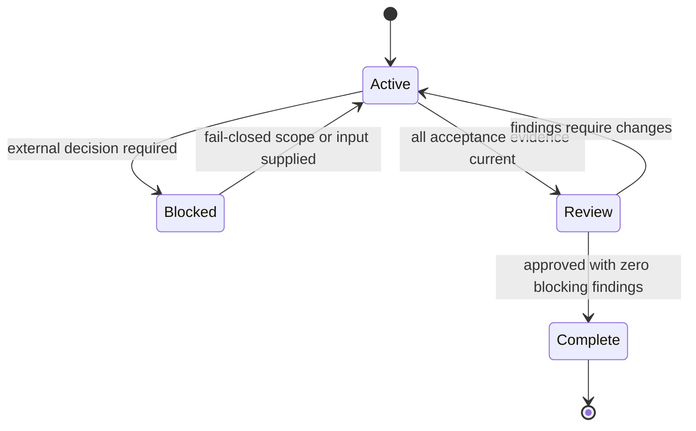

<!-- Inputs: production AI coding harness, 2026-08-31, GitHub Copilot, AgentX Engineer -->

# Execution Plan: Production AI Coding Harness

**Author:** AgentX Engineer
**Date:** 2026-08-31
**Issue:** https://github.com/jnPiyush/HVE-Forge/issues/2
**Status:** Complete

## Purpose / Big Picture

Build a runnable, production-oriented AI coding harness whose deterministic control plane owns policy, durability, replay, evidence, and completion. The first release operates in credential-free local-only mode because no production target, compliance regime, live-model authorization, or budget was supplied. Unsupported high-risk capabilities fail closed rather than being simulated.

Success is observable when a clean checkout can restore and build with pinned dependencies, run a fixture task through the CLI, persist a tamper-evident ordered event stream, resume injected interruptions without duplicate effects, replay without providers or tools, reject hostile paths and denied capabilities, and complete only after fresh hash-bound evidence and a read-only evaluator verdict.

This is a living document. Update Progress, Surprises and Discoveries, Decision Log, exact verification results, and recovery guidance before each handoff.

## Progress

- [x] Repository and toolchain inspected.
- [x] Current harness landscape researched and source register created.
- [x] Three implementation strategies compared.
- [x] Runtime ADR and model-council synthesis accepted.
- [x] Threat model and bounded first-slice contract drafted.
- [x] GitHub issue #2 created and feature branch started.
- [x] Technical specification and versioned schemas completed and independently approved.
- [x] Deterministic kernel and CLI implemented.
- [x] Policy, workspace confinement, and approval controls implemented.
- [x] Durable resume, context, verification, and replay implemented.
- [x] Provider, MCP, and telemetry adapter contracts implemented with recorded fixtures.
- [x] Unit, integration, end-to-end, recovery, adversarial, and eval suites pass.
- [x] CI, operations documentation, and release evidence completed.
- [x] Second independent review completed and all HIGH/MEDIUM findings remediated.
- [x] Final clean re-review approved with zero Critical/HIGH/MEDIUM/LOW findings.
- [x] Compound learning captured in `docs/artifacts/learnings/LEARNING-2.md`.
- [x] Quality loop completed mechanically after six iterations and the final structured review verdict.

## Surprises and Discoveries

- Observation: The remote repository contains only the initial README and license; all AgentX guidance and current design artifacts are untracked local inputs.
  Evidence: `git log -3 --oneline` and `git status --short --branch --ignored` on 2026-08-31.
- Observation: .NET SDK 10.0.111, Node.js 24.14.0, Python 3.12.10, and PowerShell are installed; Docker and uv are unavailable.
  Evidence: local toolchain probe on 2026-08-31.
- Observation: Current AgentX guidance points to Microsoft Agent Framework packages that are preview, while the design requires provider neutrality and strict replay.
  Evidence: AI-agent skill and landscape source register.
- Observation: NuGet HTTPS metadata lookup failed in this environment, so initial test dependency pins use the installed .NET 10 xUnit template versions and must be revalidated in CI.
  Evidence: temporary `dotnet new xunit -f net10.0 --no-restore` probe selected xUnit 2.9.3, runner 3.1.4, test SDK 17.14.1, and coverlet collector 6.0.4.
- Observation: Checkpoint, evaluation, and completion payloads contain exact physical hashes derived from run IDs, timestamps, and event-chain heads, so a semantic trace cannot include those fields and remain stable across fresh runs.
  Evidence: two current fixture runs differed only in checkpoint physical bindings and projection hashes. The semantic trace now excludes the explicitly listed derived physical fields while physical replay still validates them.
- Observation: Hash-valid events were insufficient while mutable run metadata remained outside the chain, and aggregate verification counts were insufficient for contract-aware evaluation.
  Evidence: independent review found both bypasses. The first event now binds the complete descriptor, and the evaluator consumes a schema-validated four-criterion runtime contract plus named evidence.

## Alternatives Considered

1. Embed OpenAI Codex App Server or SDK. Rejected as the kernel because provider-specific thread state and policy behavior would become authoritative; retain as an optional adapter.
2. Build on Microsoft Agent Framework, LangGraph, OpenAI Agents SDK, or Claude Agent SDK. Rejected as the core because framework state, retries, and tool semantics can obscure the required deterministic boundary; retain as optional leaf integrations.
3. Implement a focused .NET 10 modular monolith over explicit provider, tool, persistence, evidence, and telemetry ports. Selected because it owns trust and replay invariants while allowing later adapters.
4. Start with services and a database. Rejected until measured concurrency or isolation demands them; a modular monolith and append-only JSONL minimize the first proof surface.

## Decision Log

- Decision: Operate local-only and credential-free until deployment, compliance, provider, and budget inputs are explicit.
  Rationale: This is the only reversible default that prevents accidental spend, data disclosure, or production access.
  Date/Author: 2026-08-31, GitHub Copilot.
- Decision: Use .NET 10 with no external production package in the deterministic kernel.
  Rationale: The installed stable SDK supports strict types, JSON, hashing, async I/O, and cross-platform packaging while minimizing supply-chain exposure.
  Date/Author: 2026-08-31, GitHub Copilot.
- Decision: Treat Windows path confinement as workspace safety, not an OS sandbox.
  Rationale: Docker or a microVM is not available; arbitrary shell, process, network, secret, and remote-write capabilities remain unregistered.
  Date/Author: 2026-08-31, GitHub Copilot.
- Decision: Use JSONL hash-chained events as the MVP store behind an interface.
  Rationale: It is inspectable and replayable. Optimistic single-writer leases are sufficient for the local host; a database remains an adapter decision.
  Date/Author: 2026-08-31, GitHub Copilot.
- Decision: Split work into gate-checked milestones and keep the first implementation bounded by the policy/replay contract.
  Rationale: The full request is high-risk and broad; a thin falsifiable kernel must exist before live providers or generalized orchestration.
  Date/Author: 2026-08-31, GitHub Copilot.

## Context and Orientation

- Research: `docs/research/ai-coding-harness-landscape.md`
- Architecture decision: `docs/artifacts/adr/ADR-001-harness-runtime.md`
- Council: `docs/artifacts/adr/COUNCIL-001-harness-runtime.md`
- Threat model: `docs/security/ai-coding-harness-threat-model.md`
- Active work contract: `docs/execution/contracts/CONTRACT-001-policy-replay-kernel.md`
- Technical specification: `docs/artifacts/specs/SPEC-002-production-harness.md`
- Progress log: `docs/execution/progress/ISSUE-002-log.md`

The production solution will use `src/` projects for Domain, Application, Infrastructure, and CLI; `tests/` projects for unit, architecture, integration, and end-to-end coverage; `schemas/` for versioned JSON contracts; `prompts/`, `policies/`, and `skills/` for versioned runtime assets; and `.hve/` only for ignored local run data.

## Pre-Conditions

- [x] GitHub issue #2 exists.
- [x] Work is isolated on `feature/2-production-harness`.
- [x] Current repository instructions and relevant skills were read.
- [x] The task is classified high-risk because it covers policy, sandboxing, credentials, production completion, and supply chain.
- [x] The quality loop is active with a five-iteration minimum.
- [x] No production credentials or live provider authority are available to the runtime.

## Plan of Work

Implement milestones in dependency order. Each milestone leaves a runnable repository and records command output in an evidence summary before the next begins. The first substantive edit is followed by a focused test that falsifies the pure transition or canonical-hash behavior. External provider, MCP, and OpenTelemetry behavior stays behind contracts and recorded fixtures until the deterministic kernel and policy gates pass.

## Steps

| # | Step | Owner | Status | Acceptance check |
|---:|---|---|---|---|
| 1 | Research, ADR, threat model, spec, schemas, and work contract | Architect / Engineer | Complete | Document structure, links, ASCII, schema validation, council alignment |
| 2 | Scaffold modular .NET solution and pure domain reducer | Engineer | Complete | Locked restore, warning-free build, reducer tests |
| 3 | Add event store, canonical hashing, workspace policy, and fixture provider | Engineer | Complete | Hash-chain, deny-path, idempotency, and tamper tests |
| 4 | Add CLI lifecycle and operator controls | Engineer | Complete | End-to-end fixture and stable exit-code tests |
| 5 | Add checkpoints, instruction/skill context, evidence, memory, and read-only evaluation | Engineer | Complete | Crash recovery, scoped instructions, stale-evidence rejection |
| 6 | Add provider and MCP contracts, capability negotiation, and fixtures | Engineer | Complete for recorded/offline scope | Two fixture providers and dated MCP conformance tests |
| 7 | Add telemetry vocabulary, zero-cost accounting, sanitized replay, and eval runner | Data Scientist / Engineer | Complete for fixture scope | Trace reconstruction and deterministic replay tests |
| 8 | Add CI, security/SBOM gates, operator docs, and demo evidence | DevOps / Tester | Complete | CI-equivalent local gate and evidence demo |
| 9 | Profile, simplify, adversarially test, independently review, and package | Reviewer / Tester | Complete | Zero HIGH/MEDIUM, 80% core coverage, final evidence matrix |

## Concrete Steps

Run from repository root unless noted:

1. `dotnet restore HveForge.slnx --locked-mode` after lock files exist.
2. `dotnet build HveForge.slnx -c Release --no-restore -warnaserror`.
3. `dotnet test HveForge.slnx -c Release --no-build --collect:"XPlat Code Coverage"`.
4. Run the focused unit project immediately after the state reducer is implemented.
5. Run the CLI fixture twice and compare canonical semantic trace hashes; compare replay projection hashes within each run because physical run IDs and event timestamps intentionally differ across fresh runs.
6. Inject interruption after decision, after mutation, and after verification; resume each twice.
7. Replay with provider and tool fail-if-called doubles.
8. Run hostile path, tampered event, unknown schema/tool, redaction canary, and budget tests; retain action-signature primitives for the future multi-decision loop.
9. Run repository reference, ASCII, secret, and dependency scans.
10. Run AgentX scrub, independent review, final quality-loop verdict, and completion gate.

Exact commands and observed counts will be copied into the progress and evidence artifacts as they become available. Commands must never be weakened to turn a red gate green.

## Blockers

| Blocker | Impact | Resolution | Status |
|---|---|---|---|
| Docker or microVM unavailable | Cannot claim OS/process/network sandboxing | Keep arbitrary process/network disabled; add pluggable isolation backend and document local boundary | Accepted MVP limitation |
| No provider/model/budget/compliance input | Live model and cost gates cannot be certified | Use deterministic fixtures and fail closed; require explicit operator configuration later | Accepted MVP limitation |
| Public NuGet metadata endpoint TLS failure | Direct public-feed lookup failed | The configured `azure-default` source was queried successfully and provides current JsonSchema.Net 9.4.0; locked restore remains the executable gate and CI must revalidate freshness | Resolved locally |
| No production target | Packaging/deployment hardening cannot be environment-specific | Produce local package and operations contract only | Open external decision |

## Validation and Acceptance

- [x] Clean restore and Release build succeed with pinned SDK and lock files.
- [x] Core Domain, Application, and Infrastructure line and branch coverage are each at least 80%.
- [x] A single CLI command produces ordered structured events for the fixture task.
- [x] Workspace confinement, hostile path, denial, redaction, and budget tests fail closed.
- [x] Interruption recovery is idempotent and replay performs no external effect.
- [x] Completion rejects stale hashes, altered events, missing verification, and write-capable evaluators.
- [x] Provider and MCP unsupported capabilities are explicit and tested at the recorded/shape level.
- [x] Traces reconstruct the run without content or secrets by default.
- [x] Secret, dependency, architecture, ASCII, and SBOM gates pass locally; remote provenance runs only on trusted main pushes.
- [x] Independent review reports zero Critical, HIGH, MEDIUM, and LOW findings.

## Idempotence and Recovery

All mutable run data is scoped to `.hve/runs/<run-id>/state` and `.hve/runs/<run-id>/workspace`. Event appends use contiguous sequence and previous-hash checks under a single-writer lease. Tool calls carry idempotency keys and reconcile observed before/after hashes before retry. Resume starts from persisted events and checkpoints; replay rejects corruption and never invokes provider or tool ports. A failed implementation step can be retried after fixing code because the immutable fixture remains unchanged.

## Rollback Plan

No remote or production mutation is authorized. Source changes remain on the feature branch. Revert a milestone with normal Git commits after preserving its evidence; do not rewrite shared history. Delete ignored `.hve/` run directories only after required evidence is copied to `docs/execution/evidence/`. If a dependency or adapter is unsafe, disable it in configuration and retain the core fixture path.

## Artifacts and Notes

- Source register includes URLs, publisher, date/version, maturity, confidence, and design impact.
- ADR and council select the owned deterministic kernel with explicit scope cuts.
- The threat model maps all OWASP Agentic Top 10 categories and additional harness threats.
- The active contract defines exact event, path, interruption, evidence, redaction, budget, exit-code, and coverage behavior for the first slice.

## Outcomes and Retrospective

Current outcome: the hardened local fail-closed preview is runnable and evidence-captured. A clean locked restore and warning-free Release build pass; 283 tests pass; Domain, Application, and Infrastructure each exceed 80 percent line and branch coverage; security/dependency/ASCII gates pass; a 19-component SBOM is generated; and a fresh 16-event demo replays with matching projection and semantic hashes. Descriptor/provider metadata, runtime contract criteria, persisted usage, checkpoint state, stage budgets, archive contents, and completion evidence are explicitly bound. No live provider, arbitrary shell, network, secret, external write, or production capability is enabled. Final clean re-review, compound capture, and mechanical quality-loop closure completed after six iterations and final structured approval.

## Plan Dependency Graph

## Plan Lifecycle

