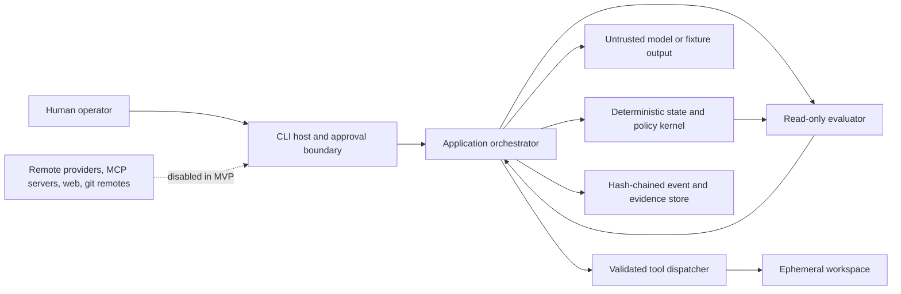

<!-- Purpose: Threat model and fail-closed controls for the HVE-Forge harness. -->

# AI Coding Harness Threat Model

**Status:** Active for local MVP; live end-user controls are planned and explicitly gated  
**Date:** 2026-09-02  
**Classification:** Public design document

## Security posture

The current MVP operates in fail-closed local-only mode. It has no live model credentials, arbitrary process execution, network client, remote-write integration, deployment capability, or secret broker. Its security claim is controlled fixture confinement plus deterministic policy and internal-consistency evidence. It does not claim container, microVM, kernel, process, network isolation, or attacker-resistant audit authenticity.

Organization policy is authoritative. Repository instructions, prompts, skills, tool metadata, model output, retrieved files, and MCP payloads are untrusted data and cannot relax it.

Generated editor customizations are currently declarative. Native editor tools can bypass the CLI kernel, so they are not security-ready until default privileged grants are removed and effects are mediated. Before a live provider is enabled, every model-bound repository byte must carry an origin/trust envelope and every provider request must have a preceding durable metadata-only receipt.

## Trust boundaries

## Assets

- Source repositories and user changes.
- Credentials, environment variables, tokens, and local credential stores.
- Organization and repository policy.
- Event history, approvals, evidence, audit integrity, and replay fixtures.
- Model/provider spend and rate limits.
- User identity, task ownership, and cross-tenant isolation.
- Acceptance tests, evaluator rubrics, and completion decisions.

## Threat actors

- A malicious or compromised repository.
- Directly malicious user input.
- Indirect prompt injection in files, web content, dependencies, tool output, or MCP metadata.
- A compromised model, provider, plugin, skill, hook, package, or MCP server.
- A buggy agent stuck in loops or escalating privileges.
- A local unprivileged process racing filesystem checks.
- An operator misled by vague approval or fabricated evidence.

## OWASP Top 10 for Agentic Applications 2026

| ID | Threat | Representative abuse case | MVP control | Residual status |
|---|---|---|---|---|
| ASI01 | Agent goal hijacking | Repository text tells the model to ignore the task and exfiltrate data. | No live retrieval reaches a provider in the current MVP. Origin envelopes and injection tests are mandatory before enabling that path. | Open for the live provider. |
| ASI02 | Tool misuse and exploitation | Model requests path traversal or a destructive command. | The current exact replacement path validates one confined operation. The general registry exists but is not wired; no process tool is registered. | Mitigated only for the fixture scope. |
| ASI03 | Identity and privilege abuse | Agent reuses ambient GitHub/cloud credentials. | Credentials are not passed to the run; external and secret-bearing actions are unregistered. | Mitigated for MVP; broker needed later. |
| ASI04 | Agentic supply-chain compromise | A downloaded skill, package, hook, or MCP server adds hidden behavior. | No dynamic code loading; pinned dependencies; provenance/hash fields; review required before activation. | Open for future integrations. |
| ASI05 | Unexpected code execution | Tool output or filename triggers a shell or interpreter. | No process execution; content is never evaluated; file tool performs one typed replace action. | Mitigated for MVP. |
| ASI06 | Memory and context poisoning | Malicious content is persisted as trusted long-term instruction. | MVP stores typed decisions/evidence only; untrusted content cannot become policy; no long-term user memory. | Open for future memory feature. |
| ASI07 | Insecure inter-agent communication | A child agent message is treated as human approval. | No multi-agent execution in MVP; future handoffs require typed lineage and real approval identity. | Out of MVP. |
| ASI08 | Cascading failures | Provider retries or children multiply cost and side effects. | Hard decisions/tool/time limits, idempotency keys, no nested agents, typed terminal reasons. | Mitigated for MVP. |
| ASI09 | Human-agent trust exploitation | Agent claims tests passed using stale or fabricated logs. | The fixture completion gate checks local hashes, evaluator capability, chain head, and verdict. Working-tree freshness and independent authenticity are not yet implemented. | Open for end-user release. |
| ASI10 | Rogue or emergent behavior | Agent loops, duplicates writes, or expands scope. | Single-decision workflow, hard decision/dispatch/time/token/cost limits, explicit contract, confined idempotent tool, cancellation, deterministic replay. | Mitigated for current single-decision scope; multi-decision loop detection is deferred. |

## Additional abuse cases

| Threat | Control and test |
|---|---|
| Direct prompt injection | Model output never bypasses policy; unknown tool calls are denied. |
| Indirect prompt injection | No repository content reaches a live provider today. Origin-tagged bounded context and injection tests must land before that changes. |
| Data exfiltration and SSRF | No network tool in MVP; later URL adapters require scheme/host/IP validation before and after DNS and redirects. |
| Dependency confusion | Exact versions, a project-pinned approved Microsoft npm mirror, allowlisted HTTPS tarball origins, SHA-512 lock/SBOM hashes, licenses, audit, and provenance checks. |
| Test tampering | Acceptance assets are outside the mutable fixture path; evidence binds verifier and hashes; changes invalidate review. |
| Artifact forgery and audit tampering | SHA-256 chaining detects corruption and partial tampering. Attacker-resistant authenticity requires an independently retained signed head and commit-bound CI attestation. |
| Command obfuscation | No generic command string or shell in MVP. Future process tool will normalize executable, arguments, cwd, environment, redirects, pipes, and children before policy. |
| Unicode/control tricks | Domain identifiers are ASCII-constrained; paths reject control and invalid characters; source files remain ASCII per repository policy. |
| Output parser attacks | Typed JSON parsing with size/depth limits; no dynamic type metadata or code execution. |
| Symlink/junction/path escape | Reject reparse points in every existing ancestor and target, rooted/UNC/device/ADS/traversal paths, and paths outside canonical root. |
| TOCTOU path swap | Repeat containment and reparse validation immediately before atomic replacement. Any concurrent local actor that can mutate the workspace remains out of scope until a container/microVM or handle-relative no-follow backend is available. |
| Secret disclosure in logs | The current literal canary redactor is fixture-scoped. Live task ingress requires field classification, secret rejection, and structured sink redaction before release. |
| Denial of wallet/service | Zero live spend in MVP; hard budgets and no credential fallthrough in replay. |
| Cross-tenant leakage | Single-user MVP; future host must scope every task/store/secret/provider handle by owner and authorize at each service. |
| Malicious model reasoning state | Opaque reasoning handles are stored as secret-class references or omitted, never parsed or surfaced as instructions. |

## Policy classes

Every action is classified as one of:

- `read`
- `workspace_write`
- `external_write`
- `destructive`
- `privileged`
- `secret_bearing`

The MVP can allow only specifically named `read` actions and one `workspace_write` action. All other classes are denied. Deny overrides allow. An unavailable policy or confinement backend blocks dispatch.

## Approval contract

The MVP has no action that can be approved into external/destructive execution. Future approval requests must include exact normalized action, risk class, target resources, redacted arguments, expected effect, alternatives, expiry, and approving identity. A model or agent message can never satisfy approval.

## Incident response

1. Cancel the run and disable provider/remote adapters.
2. Preserve the event store, evidence, policy version, fixture hashes, and process metadata without credentials.
3. Verify chain integrity and identify the first untrusted or unauthorized transition.
4. Rotate any exposed credential at its issuer; do not rely on log deletion.
5. Quarantine affected skills, packages, MCP servers, prompts, or fixtures by hash.
6. Reproduce with replay and a sanitized fixture.
7. Add a regression/attack test before re-enabling the capability.
8. Publish a concise incident timeline and update the control matrix.

## Security release gates

- No critical or high finding.
- No material medium finding without an explicit human waiver tied to a release.
- All deny-path, escape, tamper, redaction, loop, budget, and replay tests pass.
- Dependency and secret scans pass.
- SBOM is generated from locked dependencies.
- The independent evaluator has no write/process/network/provider capability.
- Security claims accurately distinguish policy, workspace confinement, and OS isolation.
- Packed distribution assets resolve independently of the untrusted target workspace.
- Default generated host artifacts grant no native privileged tools while their tier is declarative.
- Trust envelopes precede live retrieval, and a durable receipt precedes every live provider send.
- Completion evidence is fresh against tracked and untracked workspace content and is bound to a trusted release identity.
